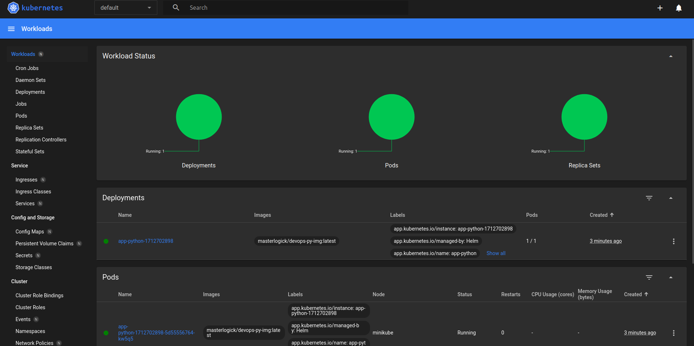

# Task 1

install chart
```shell
user@user-PC:~/S24-core-course-labs/k8s$ helm install app-python -g
NAME: app-python-1712702898
LAST DEPLOYED: Wed Apr 10 01:48:18 2024
NAMESPACE: default
STATUS: deployed
REVISION: 1
NOTES:
1. Get the application URL by running these commands:
  export POD_NAME=$(kubectl get pods --namespace default -l "app.kubernetes.io/name=app-python,app.kubernetes.io/instance=app-python-1712702898" -o jsonpath="{.items[0].metadata.name}")
  export CONTAINER_PORT=$(kubectl get pod --namespace default $POD_NAME -o jsonpath="{.spec.containers[0].ports[0].containerPort}")
  echo "Visit http://127.0.0.1:8080 to use your application"
  kubectl --namespace default port-forward $POD_NAME 8080:$CONTAINER_PORT
```

check everything is okay

```shell
user@user-PC:~/S24-core-course-labs/k8s$ minikube dashboard
🤔  Verifying dashboard health ...
🚀  Launching proxy ...
🤔  Verifying proxy health ...
🎉  Opening http://127.0.0.1:40823/api/v1/namespaces/kubernetes-dashboard/services/http:kubernetes-dashboard:/proxy/ in your default browser...
^C

```



```shell
user@user-PC:~/S24-core-course-labs/k8s$ kubectl get pods,svc
NAME                                         READY   STATUS    RESTARTS   AGE
pod/app-python-1712702898-5d55556764-kw5q5   1/1     Running   0          4m39s

NAME                            TYPE        CLUSTER-IP     EXTERNAL-IP   PORT(S)    AGE
service/app-python-1712702898   ClusterIP   10.98.171.27   <none>        8080/TCP   4m39s
service/kubernetes              ClusterIP   10.96.0.1      <none>        443/TCP    7d
user@user-PC:~/S24-core-course-labs/k8s$ 
```

# Task 2

```shell
user@user-PC:~/S24-core-course-labs/k8s$ kubectl get po
NAME                                    READY   STATUS      RESTARTS   AGE
app-python-1712704122-fcf65c844-trqxf   1/1     Running     0          34s
postinstall-hook                        0/1     Completed   0          34s
preinstall-hook                         0/1     Completed   0          47s
user@user-PC:~/S24-core-course-labs/k8s$ 
```

```shell
user@user-PC:~/S24-core-course-labs/k8s$ kubectl describe po preinstall-hook
Name:             preinstall-hook
Namespace:        default
Priority:         0
Service Account:  default
Node:             minikube/192.168.49.2
Start Time:       Wed, 10 Apr 2024 02:08:42 +0300
Labels:           <none>
Annotations:      helm.sh/hook: pre-install
Status:           Succeeded
IP:               10.244.0.25
IPs:
  IP:  10.244.0.25
Containers:
  pre-install-container:
    Container ID:  docker://122a841f59889ed4186985cded050ad1e32e2deaa8cb56359ba2a18babf59cef
    Image:         busybox
    Image ID:      docker-pullable://busybox@sha256:c3839dd800b9eb7603340509769c43e146a74c63dca3045a8e7dc8ee07e53966
    Port:          <none>
    Host Port:     <none>
    Command:
      sh
      -c
      echo The pre-install hook is running && sleep 5
    State:          Terminated
      Reason:       Completed
      Exit Code:    0
      Started:      Wed, 10 Apr 2024 02:08:48 +0300
      Finished:     Wed, 10 Apr 2024 02:08:53 +0300
    Ready:          False
    Restart Count:  0
    Environment:    <none>
    Mounts:
      /var/run/secrets/kubernetes.io/serviceaccount from kube-api-access-tf95m (ro)
Conditions:
  Type              Status
  Initialized       True 
  Ready             False 
  ContainersReady   False 
  PodScheduled      True 
Volumes:
  kube-api-access-tf95m:
    Type:                    Projected (a volume that contains injected data from multiple sources)
    TokenExpirationSeconds:  3607
    ConfigMapName:           kube-root-ca.crt
    ConfigMapOptional:       <nil>
    DownwardAPI:             true
QoS Class:                   BestEffort
Node-Selectors:              <none>
Tolerations:                 node.kubernetes.io/not-ready:NoExecute op=Exists for 300s
                             node.kubernetes.io/unreachable:NoExecute op=Exists for 300s
Events:
  Type    Reason     Age   From               Message
  ----    ------     ----  ----               -------
  Normal  Scheduled  118s  default-scheduler  Successfully assigned default/preinstall-hook to minikube
  Normal  Pulling    118s  kubelet            Pulling image "busybox"
  Normal  Pulled     114s  kubelet            Successfully pulled image "busybox" in 4.541s (4.541s including waiting)
  Normal  Created    113s  kubelet            Created container pre-install-container
  Normal  Started    113s  kubelet            Started container pre-install-container
user@user-PC:~/S24-core-course-labs/k8s$ 
```

```shell
user@user-PC:~/S24-core-course-labs/k8s$ kubectl describe po postinstall-hook
Name:             postinstall-hook
Namespace:        default
Priority:         0
Service Account:  default
Node:             minikube/192.168.49.2
Start Time:       Wed, 10 Apr 2024 02:08:55 +0300
Labels:           <none>
Annotations:      helm.sh/hook: post-install
Status:           Succeeded
IP:               10.244.0.27
IPs:
  IP:  10.244.0.27
Containers:
  post-install-container:
    Container ID:  docker://151bec5a7959b2ce1aa74359ef3abc7412640aef32e1f1215ca57e64de6cbf99
    Image:         busybox
    Image ID:      docker-pullable://busybox@sha256:c3839dd800b9eb7603340509769c43e146a74c63dca3045a8e7dc8ee07e53966
    Port:          <none>
    Host Port:     <none>
    Command:
      sh
      -c
      echo The post-install hook is running && sleep 5
    State:          Terminated
      Reason:       Completed
      Exit Code:    0
      Started:      Wed, 10 Apr 2024 02:08:59 +0300
      Finished:     Wed, 10 Apr 2024 02:09:04 +0300
    Ready:          False
    Restart Count:  0
    Environment:    <none>
    Mounts:
      /var/run/secrets/kubernetes.io/serviceaccount from kube-api-access-zmwft (ro)
Conditions:
  Type              Status
  Initialized       True 
  Ready             False 
  ContainersReady   False 
  PodScheduled      True 
Volumes:
  kube-api-access-zmwft:
    Type:                    Projected (a volume that contains injected data from multiple sources)
    TokenExpirationSeconds:  3607
    ConfigMapName:           kube-root-ca.crt
    ConfigMapOptional:       <nil>
    DownwardAPI:             true
QoS Class:                   BestEffort
Node-Selectors:              <none>
Tolerations:                 node.kubernetes.io/not-ready:NoExecute op=Exists for 300s
                             node.kubernetes.io/unreachable:NoExecute op=Exists for 300s
Events:
  Type    Reason     Age    From               Message
  ----    ------     ----   ----               -------
  Normal  Scheduled  2m17s  default-scheduler  Successfully assigned default/postinstall-hook to minikube
  Normal  Pulling    2m18s  kubelet            Pulling image "busybox"
  Normal  Pulled     2m14s  kubelet            Successfully pulled image "busybox" in 3.684s (3.684s including waiting)
  Normal  Created    2m14s  kubelet            Created container post-install-container
  Normal  Started    2m14s  kubelet            Started container post-install-container
user@user-PC:~/S24-core-course-labs/k8s$ 
```

# Bonus

```shell
user@user-PC:~/S24-core-course-labs/k8s$ helm install app-java -g
NAME: app-java-1712703788
LAST DEPLOYED: Wed Apr 10 02:03:08 2024
NAMESPACE: default
STATUS: deployed
REVISION: 1
NOTES:
1. Get the application URL by running these commands:
  export POD_NAME=$(kubectl get pods --namespace default -l "app.kubernetes.io/name=app-java,app.kubernetes.io/instance=app-java-1712703788" -o jsonpath="{.items[0].metadata.name}")
  export CONTAINER_PORT=$(kubectl get pod --namespace default $POD_NAME -o jsonpath="{.spec.containers[0].ports[0].containerPort}")
  echo "Visit http://127.0.0.1:8080 to use your application"
  kubectl --namespace default port-forward $POD_NAME 8080:$CONTAINER_PORT
user@user-PC:~/S24-core-course-labs/k8s$   export POD_NAME=$(kubectl get pods --namespace default -l "app.kubernetes.io/name=app-java,app.kubernetes.io/instance=app-java-1712703788" -o jsonpath="{.items[0].metadata.name}")
  export CONTAINER_PORT=$(kubectl get pod --namespace default $POD_NAME -o jsonpath="{.spec.containers[0].ports[0].containerPort}")
  echo "Visit http://127.0.0.1:8080 to use your application"
  kubectl --namespace default port-forward $POD_NAME 8080:$CONTAINER_PORT
Visit http://127.0.0.1:8080 to use your application
Forwarding from 127.0.0.1:8080 -> 8080
Forwarding from [::1]:8080 -> 8080
Handling connection for 8080
```
